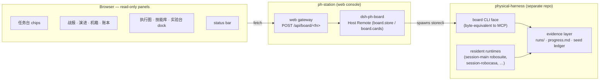

# ph-station — physical-harness operations console

[](https://www.typescriptlang.org/)
[](https://nodejs.org/)
[](https://pnpm.io/)
[](https://react.dev/)
[](https://dockview.dev/)
[](LICENSE)

English | [简体中文](#简体中文)

`ph-station` is the web operations console for **[physical-harness](https://github.com/Z-Robotics-Lab/physical-harness)** — the robotics evidence harness that governs simulation rollouts, promotes skills through paired statistical gates, and maintains a chain-audited episode ledger. The console renders the harness's campaign evidence beside the agent chat as a set of read-only operator surfaces: the **execution graph**, the campaign **process flow** and battle report, run **trajectories**, the **simulation render** (取景窗), the **Skill Vault** lineage, and the **evolution panel**. From a single screen an operator drives missions and reviews their evidence, without a second terminal.

The console holds no business logic. Every value a panel displays is fetched from the harness's `board` evidence layer over the wire; TypeScript formats and lays it out, and computes nothing.

## Architecture



The browser panels fetch `/api/board/<fn>` (for example `stores`, `store`, `cards`, `ledger`, `campaignProgress`, `sessions`). The gateway routes each request to the `dsh-ph-board` Host Remote, which shells the harness's `board` CLI face and returns its bytes unchanged. The harness's resident runtimes write the evidence; the console only reads it. When the board bridge is not mounted (a console started with no `PH_BOARD_*` environment), the panels report the data plane as unavailable — they never fabricate a value.

## Upstream and attribution

Built on **[deepseek-harness](https://github.com/deepseek-ai/deepseek-harness)** by DeepSeek. `ph-station` keeps the upstream harness as its interface layer and adds the physical-harness operator panels on top.

- Licensed under [MIT](LICENSE), the same as upstream. All upstream attribution and [THIRD_PARTY_NOTICES.md](THIRD_PARTY_NOTICES.md) are kept intact.
- The `upstream` git remote (`deepseek-ai/deepseek-harness`) is retained so upstream fixes can be merged forward.

Everything this fork adds lives in one host package, seven client packages, and the console brand:

- `packages/host/dsh-ph-board` — a read-only `board` Host Remote bridging the panels to the evidence layer.
- `packages/client/ui-ph-battle` — the 战报 battle-report panel.
- `packages/client/ui-ph-panels` — the 演进 / 机箱 / 账本 panels, the 任务台 chips, and the status bar.
- `packages/client/ui-ph-ops` — the operator rail and graph-first mission cockpit.
- `packages/client/ui-ph-livegraph` — the 执行图 live execution-graph panel.
- `packages/client/ui-ph-vault` — the 技能库 Skill Vault wiki panel.
- `packages/client/ui-ph-dash` — the 实验台 dockview dashboard docking the other panels on one screen.
- `packages/client/ui-ph-icons` — the shared cockpit icon set, a vendored MIT subset of tabler-icons.
- `packages/client/ui-brand-official` — the `physical-harness` wordmark and `PH` monogram.

## Install and build

Node 22 (or ≥24) and pnpm, selected via nvm and corepack:

```sh
source ~/.nvm/nvm.sh && nvm use 22   # engines: ^22.19.0 || >=24.0.0
corepack enable                       # provides pnpm 11.7.0 (see packageManager)
pnpm install                          # install workspace dependencies
pnpm run build                        # tsc emits lib/types, tsdown bundles the runtime
pnpm run typecheck                    # the build tsconfig is stricter than typecheck
pnpm run dev:web                      # watch-mode Web UI for panel development
```

### External libraries

| Library | Version | For | Notes |
|---|---|---|---|
| Node.js | `^22.19.0 \|\| >=24.0.0` | runtime | select node 22 via nvm |
| pnpm | `11.7.0` | workspace package manager | via corepack (`packageManager`) |
| TypeScript | `^6.0.3` | typecheck + `lib/types` emit | strict everywhere |
| tsdown | `^0.22.2` | runtime bundler (`pnpm build`) | build tsconfig stricter than typecheck |
| vitest | `^4.1.8` | unit / e2e / snapshot tests | — |
| @types/node | `^22.20.0` | Node typings | — |
| vendored Cordis | pinned (`vendor/`) | plugin kernel the harness is built on | rescoped `@deepseek-ai/*`, MIT ([manifest](vendor/README.md)) |
| native/landlock-run | vendored prebuilt | Linux x64/arm64 sandbox helper | Linux-only runtime feature, own LICENSE |

Full third-party disclosure: [THIRD_PARTY_NOTICES.md](THIRD_PARTY_NOTICES.md).

## Running with physical-harness

`ph-station` is the operator surface; **physical-harness** is the backend that owns the robots, the runtimes, and the evidence. Install the harness first (its README covers the base install and the per-sim venvs), then let it start this console:

1. Install and build this console (above).
2. Install physical-harness — the base install is `pip install -e ".[dev]"` (needs only numpy + zstandard); sim cards (robosuite, robocasa) are **separate venvs**, see the physical-harness README and its `requirements.md`.
3. Start everything from the harness's cockpit script, which builds this fork, injects the `PH_BOARD_*` paths, and serves the Web UI at `http://127.0.0.1:3080`:

```sh
/path/to/physical-harness/scripts/cockpit
```

The console is **not launched standalone** — the cockpit is the single entry point. The connection between them is `POST /api/board/<fn>`: the gateway forwards each panel fetch to the `board` CLI face over the `PH_BOARD_*` paths, so the panels render exactly what the harness's evidence layer holds.

## Panels

All panels are read-only operator surfaces beside the chat; every value comes from the `board` Remote (`board.store` / `board.cards`), which reads the harness evidence layer.

- **任务台** — preset chips above the composer that prefill an editable task prompt (they never auto-send).
- **战报** — the per-campaign battle report: paired gate, McNemar fixed/broken, held-out badge, per-generation Δpp.
- **演进** — the evolution monitor: per-generation Δpp bars plus the progress feed and in-flight campaign cards.
- **机箱** — the chassis card grid read from plugin manifests.
- **账本** — the seed-block ledger table.
- **执行图 / 技能库 / 实验台** — the live execution graph, the Skill Vault wiki, and the dockview dashboard.
- **status bar** — MODE, boot facts, heartbeat, board reachability, and the 取景窗 (render) chip.

## Development

Repository conventions live in [AGENTS.md](AGENTS.md); architecture in [docs/architecture.md](docs/architecture.md). Deeper material stays under [docs/](docs/) — link to it rather than inline it.

## License

[MIT](LICENSE). Third-party dependencies and their licenses are disclosed in [THIRD_PARTY_NOTICES.md](THIRD_PARTY_NOTICES.md).

---

## 简体中文

[English](#ph-station--physical-harness-operations-console) | 简体中文

`ph-station` 是 **[physical-harness](https://github.com/Z-Robotics-Lab/physical-harness)** 的 Web 操作台。physical-harness 是一台机器人证据引擎：治理仿真 rollout、以配对统计门禁晋级技能、维护链式审计的 episode 账本。本操作台把 harness 的 campaign 证据以一组**只读操作面**呈现在 agent 对话旁边：**执行图谱**、campaign 的**过程流**与战报、运行**轨迹**、**仿真取景窗**、**技能库谱系**，以及**演进面板**。操作员在同一屏内提任务、看证据，无需第二个终端。

操作台不含任何业务逻辑。面板显示的每个数值都经由 harness 的 `board` 证据层从线上取回；TypeScript 只负责格式化与排版，不做任何计算。

### 架构


浏览器面板请求 `/api/board/<fn>`（如 `stores`、`store`、`cards`、`ledger`、`campaignProgress`、`sessions`）。网关把每个请求路由给 `dsh-ph-board` Host Remote，后者调用 harness 的 `board` CLI 面并原样返回其字节。harness 的常驻运行时负责写证据，操作台只做读取。当 board 桥接未挂载（启动时未提供 `PH_BOARD_*` 环境变量）时，面板会报告数据面不可用，绝不伪造数值。

### 上游与署名

本项目构建于 DeepSeek 的 **[deepseek-harness](https://github.com/deepseek-ai/deepseek-harness)**。`ph-station` 将上游 harness 保留为接口层，并在其上新增 physical-harness 操作面板。

- 采用与上游一致的 [MIT](LICENSE) 许可；完整保留上游署名与 [THIRD_PARTY_NOTICES.md](THIRD_PARTY_NOTICES.md)。
- 保留 `upstream` git remote（`deepseek-ai/deepseek-harness`），以便向前合并上游修复。

本 fork 的全部新增内容落在一个 host package、七个 client package 以及操作台品牌中：

- `packages/host/dsh-ph-board` —— 只读的 `board` Host Remote，把面板桥接到证据层。
- `packages/client/ui-ph-battle` —— 战报面板。
- `packages/client/ui-ph-panels` —— 演进 / 机箱 / 账本 面板、任务台 chips 与状态栏。
- `packages/client/ui-ph-ops` —— 指挥员侧栏与 graph-first 任务驾驶舱。
- `packages/client/ui-ph-livegraph` —— 执行图实时执行图面板。
- `packages/client/ui-ph-vault` —— 技能库 Skill Vault wiki 面板。
- `packages/client/ui-ph-dash` —— 实验台 dockview 仪表盘，把其余面板停靠在同一屏。
- `packages/client/ui-ph-icons` —— 共享的驾驶舱图标集，vendored 的 tabler-icons MIT 子集。
- `packages/client/ui-brand-official` —— `physical-harness` 字标与 `PH` 徽标。

### 安装与构建

Node 22（或 ≥24）+ pnpm，经 nvm 与 corepack 选择：

```sh
source ~/.nvm/nvm.sh && nvm use 22   # engines: ^22.19.0 || >=24.0.0
corepack enable                       # provides pnpm 11.7.0 (see packageManager)
pnpm install                          # install workspace dependencies
pnpm run build                        # tsc emits lib/types, tsdown bundles the runtime
pnpm run typecheck                    # the build tsconfig is stricter than typecheck
pnpm run dev:web                      # watch-mode Web UI for panel development
```

#### 外部依赖

| 库 | 版本 | 用途 | 备注 |
|---|---|---|---|
| Node.js | `^22.19.0 \|\| >=24.0.0` | 运行时 | 经 nvm 选 node 22 |
| pnpm | `11.7.0` | workspace 包管理器 | 经 corepack（`packageManager`） |
| TypeScript | `^6.0.3` | typecheck + `lib/types` 产出 | 全量 strict |
| tsdown | `^0.22.2` | 运行时打包（`pnpm build`） | build tsconfig 比 typecheck 更严 |
| vitest | `^4.1.8` | 单元 / e2e / snapshot 测试 | — |
| @types/node | `^22.20.0` | Node 类型 | — |
| vendored Cordis | pinned（`vendor/`） | harness 所基于的插件内核 | rescoped `@deepseek-ai/*`，MIT（[manifest](vendor/README.md)） |
| native/landlock-run | vendored 预编译 | Linux x64/arm64 沙箱助手 | 仅 Linux 运行时特性，自带 LICENSE |

完整第三方披露见 [THIRD_PARTY_NOTICES.md](THIRD_PARTY_NOTICES.md)。

### 两者协同运行

`ph-station` 是操作员界面；**physical-harness** 是拥有机器人、运行时与证据的后端。请先安装 harness（其 README 覆盖 base install 与 per-sim venv），再由它拉起本操作台：

1. 安装并构建本操作台（见上）。
2. 安装 physical-harness —— base install 为 `pip install -e ".[dev]"`（只需 numpy + zstandard）；仿真卡（robosuite、robocasa）是**独立 venv**，见 physical-harness README 及其 `requirements.md`。
3. 从 harness 的 cockpit 脚本一键启动全部：它会构建本 fork、注入 `PH_BOARD_*` 路径，并在 `http://127.0.0.1:3080` 提供 Web UI：

```sh
/path/to/physical-harness/scripts/cockpit
```

操作台**不单独启动**，cockpit 是唯一入口。两者之间的连接是 `POST /api/board/<fn>`：网关把每个面板请求经 `PH_BOARD_*` 路径转给 `board` CLI 面，因此面板渲染的正是 harness 证据层所持有的内容。

### 面板

所有面板都是对话旁的只读操作面；每个数值都来自 `board` Remote（`board.store` / `board.cards`），由它读取 harness 证据层。

- **任务台** —— 输入框上方的预设 chips，用于预填一段可编辑的任务提示词（永不自动发送）。
- **战报** —— 单次 campaign 的战报：paired gate、McNemar fixed/broken、held-out 徽标、每代 Δpp。
- **演进** —— 演进监视器：每代 Δpp 条形图，以及进度 feed 与进行中的 campaign 卡片。
- **机箱** —— 从 plugin manifest 读取的机箱卡片网格。
- **账本** —— seed-block 账本表格。
- **执行图 / 技能库 / 实验台** —— 实时执行图、Skill Vault wiki 与 dockview 仪表盘。
- **状态栏** —— MODE、boot 事实、心跳、board 可达性，以及取景窗（render）chip。

### 开发

仓库约定见 [AGENTS.md](AGENTS.md)；架构见 [docs/architecture.md](docs/architecture.md)。更深的材料留在 [docs/](docs/) 中，链接过去而非内联。

### 许可证

[MIT](LICENSE)。第三方依赖及其许可证见 [THIRD_PARTY_NOTICES.md](THIRD_PARTY_NOTICES.md)。
