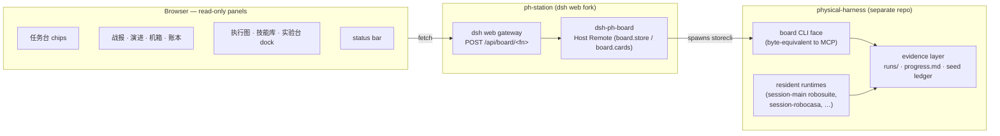

# physical-harness 操作台 (ph-station)

English | [中文](README.zh.md)

`ph-station` is the lab console for **[physical-harness](https://github.com/Z-Robotics-Lab/physical-harness)** — a rebranded, extended fork of [DeepSeek Harness](https://github.com/deepseek-ai/deepseek-harness) (`dsh`, MIT). The harness is a plugin kernel that runs a robotics *evidence machine*: governed simulation rollouts, paired-gate skill promotion, and a chain-audited episode log. This fork keeps the upstream harness as its interface layer and adds a set of **read-only panels** that surface the harness's campaign evidence right beside the agent chat — so an operator drives missions and watches the evidence from one screen, never a second terminal.

**The red line: zero business logic in the UI.** Every number a panel shows comes from the harness's `board` evidence layer over the wire; TypeScript formats and lays out, it computes nothing.

## Architecture



The browser panels fetch `/api/board/<fn>` (e.g. `stores`, `store`, `cards`, `ledger`, `campaignProgress`, `sessions`). The gateway routes each to the `dsh-ph-board` Host Remote, which shells the harness's `board` CLI and returns its bytes unchanged. The harness's resident runtimes write the evidence; the console only reads it. When the board bridge is not mounted (a plain `dsh web` with no `PH_BOARD_*` env), panels report the data plane unavailable — they never fake a number.

## Relationship to upstream

- Licensed [MIT](LICENSE), same as upstream. All upstream attribution and [THIRD_PARTY_NOTICES.md](THIRD_PARTY_NOTICES.md) are kept intact.
- The `upstream` git remote (`deepseek-ai/deepseek-harness`) is retained so upstream fixes merge forward.
- Everything the fork adds lives in one host package, seven client packages, and the console brand:
  - `packages/host/dsh-ph-board` — a read-only `board` Host Remote bridging the panels to the evidence layer.
  - `packages/client/ui-ph-battle` — the 战报 panel.
  - `packages/client/ui-ph-panels` — the 演进 / 机箱 / 账本 panels, the 任务台 chips, and the status bar.
  - `packages/client/ui-ph-ops` — the operator rail and graph-first mission cockpit.
  - `packages/client/ui-ph-livegraph` — the 执行图 live execution-graph panel.
  - `packages/client/ui-ph-vault` — the 技能库 Skill Vault wiki panel.
  - `packages/client/ui-ph-dash` — the 实验台 dockview dashboard docking the other panels on one screen.
  - `packages/client/ui-ph-icons` — the shared cockpit icon set, a vendored MIT subset of tabler-icons.
  - **brand** — the `physical-harness` wordmark and `PH` monogram in `packages/client/ui-brand-official`.

## Install & build

Node 22 (or ≥24) and pnpm, selected via nvm and corepack:

```sh
source ~/.nvm/nvm.sh && nvm use 22   # engines: ^22.19.0 || >=24.0.0
corepack enable                       # provides pnpm 11.7.0 (see packageManager)
pnpm install                          # install workspace dependencies
pnpm run build                        # tsc emits lib/types, tsdown bundles the runtime
pnpm run typecheck                    # the build tsconfig is stricter than typecheck
pnpm run dev:web                      # watch-mode Web UI for panel development
```

### External libraries

| Library | Version | For | Notes |
|---|---|---|---|
| Node.js | `^22.19.0 \|\| >=24.0.0` | runtime | select node 22 via nvm |
| pnpm | `11.7.0` | workspace package manager | via corepack (`packageManager`) |
| TypeScript | `^6.0.3` | typecheck + `lib/types` emit | strict everywhere |
| tsdown | `^0.22.2` | runtime bundler (`pnpm build`) | build tsconfig stricter than typecheck |
| vitest | `^4.1.8` | unit / e2e / snapshot tests | — |
| @types/node | `^22.20.0` | Node typings | — |
| vendored Cordis | pinned (`vendor/`) | plugin kernel the harness is built on | rescoped `@deepseek-ai/*`, MIT ([manifest](vendor/README.md)) |
| native/landlock-run | vendored prebuilt | Linux x64/arm64 sandbox helper | Linux-only runtime feature, own LICENSE |

Full third-party disclosure: [THIRD_PARTY_NOTICES.md](THIRD_PARTY_NOTICES.md).

## Running the two together

`ph-station` is the operator *face*; **physical-harness** is the backend that owns the robots, the runtimes, and the evidence. Install the harness first (its README covers the base install and the per-sim venvs), then let it drive this console:

1. Install & build this console (above).
2. Install physical-harness — base install is `pip install -e ".[dev]"` (needs only numpy + zstandard); sim cards (robosuite, robocasa) are **separate venvs**, see the physical-harness README and its `requirements.md`.
3. Start everything from the harness's cockpit script, which builds this fork, injects the `PH_BOARD_*` paths, and serves the Web UI at `http://127.0.0.1:3080`:

```sh
/path/to/physical-harness/scripts/cockpit
```

The console is **not launched standalone** — the cockpit is the single entry point. The wire between them is `POST /api/board/<fn>`: the gateway forwards each panel fetch to the `board` CLI face over the `PH_BOARD_*` paths, so the panels render exactly what the harness's evidence layer holds.

## Panels

All panels are read-only operator surfaces beside the chat; every number comes from the `board` Remote (`board.store` / `board.cards`), which reads the harness evidence layer.

- **任务台** — preset chips above the composer that prefill an editable task prompt (they never auto-send).
- **战报** — the per-campaign battle report: paired gate, McNemar fixed/broken, held-out badge, per-generation Δpp.
- **演进** — the RSI monitor: per-generation Δpp bars plus the progress feed and in-flight campaign cards.
- **机箱** — the chassis card grid read from plugin manifests.
- **账本** — the seed-block ledger table.
- **执行图 / 技能库 / 实验台** — the live execution graph, the Skill Vault wiki, and the dockview dashboard.
- **status bar** — MODE, boot facts, heartbeat, board reachability, and the 取景窗 (render) chip.

## Development

Repo conventions live in [AGENTS.md](AGENTS.md); architecture in [docs/architecture.md](docs/architecture.md). Deeper material stays under [docs/](docs/) — link to it, don't inline it.

## License

[MIT](LICENSE). Third-party dependencies and their licenses are disclosed in [THIRD_PARTY_NOTICES.md](THIRD_PARTY_NOTICES.md).
