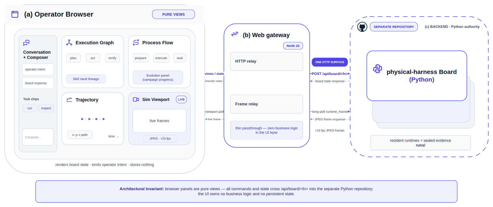

<p align="center">
  <picture>
    <source media="(prefers-color-scheme: dark)" srcset="images/zlab-logo.webp">
    
  </picture>
</p>

<h1 align="center">ph-station</h1>

<p align="center">physical-harness operations console</p>

<p align="center">
  <a href="https://www.typescriptlang.org/"></a>
  <a href="https://nodejs.org/"></a>
  <a href="https://pnpm.io/"></a>
  <a href="https://react.dev/"></a>
  <a href="https://dockview.dev/"></a>
  <a href="LICENSE"></a>
</p>

<p align="center">English | <a href="README.zh.md">简体中文</a></p>

`ph-station` is the web operations console for **[physical-harness](https://github.com/Z-Robotics-Lab/physical-harness)** — the robotics evidence harness that governs simulation rollouts, promotes skills through paired statistical gates, and maintains a chain-audited episode ledger. The console renders the harness's campaign evidence beside the agent chat as a set of read-only operator surfaces: the **execution graph**, the campaign **process flow** and battle report, run **trajectories**, the **simulation render** (取景窗), the **Skill Vault** lineage, and the **evolution panel**. From a single screen an operator drives missions and reviews their evidence, without a second terminal.

The console holds no business logic. Every value a panel displays is fetched from the harness's `board` evidence layer over the wire; TypeScript formats and lays it out, and computes nothing.

## Architecture



The browser panels fetch `/api/board/<fn>` (for example `stores`, `store`, `cards`, `ledger`, `campaignProgress`, `sessions`). The gateway routes each request to the `dsh-ph-board` Host Remote, which shells the harness's `board` CLI face and returns its bytes unchanged. The harness's resident runtimes write the evidence; the console only reads it. When the board bridge is not mounted (a console started with no `PH_BOARD_*` environment), the panels report the data plane as unavailable — they never fabricate a value.

## Upstream and attribution

Built on **[deepseek-harness](https://github.com/deepseek-ai/deepseek-harness)** by DeepSeek. `ph-station` keeps the upstream harness as its interface layer and adds the physical-harness operator panels on top.

- Licensed under [MIT](LICENSE), the same as upstream. All upstream attribution and [THIRD_PARTY_NOTICES.md](THIRD_PARTY_NOTICES.md) are kept intact.
- The `upstream` git remote (`deepseek-ai/deepseek-harness`) is retained so upstream fixes can be merged forward.

Everything this fork adds lives in one host package, seven client packages, and the console brand:

- `packages/host/dsh-ph-board` — a read-only `board` Host Remote bridging the panels to the evidence layer.
- `packages/client/ui-ph-battle` — the 战报 battle-report panel.
- `packages/client/ui-ph-panels` — the 演进 / 机箱 / 账本 panels, the 任务台 chips, and the status bar.
- `packages/client/ui-ph-ops` — the operator rail and graph-first mission cockpit.
- `packages/client/ui-ph-livegraph` — the 执行图 live execution-graph panel.
- `packages/client/ui-ph-vault` — the 技能库 Skill Vault wiki panel.
- `packages/client/ui-ph-dash` — the 实验台 dockview dashboard docking the other panels on one screen.
- `packages/client/ui-ph-icons` — the shared cockpit icon set, a vendored MIT subset of tabler-icons.
- `packages/client/ui-brand-official` — the `physical-harness` wordmark and `PH` monogram.

## Install and build

Node 22 (or ≥24) and pnpm, selected via nvm and corepack:

```sh
source ~/.nvm/nvm.sh && nvm use 22   # engines: ^22.19.0 || >=24.0.0
corepack enable                       # provides pnpm 11.7.0 (see packageManager)
pnpm install                          # install workspace dependencies
pnpm run build                        # tsc emits lib/types, tsdown bundles the runtime
pnpm run typecheck                    # the build tsconfig is stricter than typecheck
pnpm run dev:web                      # watch-mode Web UI for panel development
```

### External libraries

| Library | Version | For | Notes |
|---|---|---|---|
| Node.js | `^22.19.0 \|\| >=24.0.0` | runtime | select node 22 via nvm |
| pnpm | `11.7.0` | workspace package manager | via corepack (`packageManager`) |
| TypeScript | `^6.0.3` | typecheck + `lib/types` emit | strict everywhere |
| tsdown | `^0.22.2` | runtime bundler (`pnpm build`) | build tsconfig stricter than typecheck |
| vitest | `^4.1.8` | unit / e2e / snapshot tests | — |
| @types/node | `^22.20.0` | Node typings | — |
| vendored Cordis | pinned (`vendor/`) | plugin kernel the harness is built on | rescoped `@deepseek-ai/*`, MIT ([manifest](vendor/README.md)) |
| native/landlock-run | vendored prebuilt | Linux x64/arm64 sandbox helper | Linux-only runtime feature, own LICENSE |

Full third-party disclosure: [THIRD_PARTY_NOTICES.md](THIRD_PARTY_NOTICES.md).

## Running with physical-harness

`ph-station` is the operator surface; **physical-harness** is the backend that owns the robots, the runtimes, and the evidence. Install the harness first (its README covers the base install and the per-sim venvs), then let it start this console:

1. Install and build this console (above).
2. Install physical-harness — the base install is `pip install -e ".[dev]"` (needs only numpy); sim cards (robosuite, robocasa) are **separate venvs**, see the physical-harness README and its `requirements.md`.
3. Start everything from the harness's cockpit script, which builds this fork, injects the `PH_BOARD_*` paths, and serves the Web UI at `http://127.0.0.1:3080`:

```sh
/path/to/physical-harness/scripts/cockpit
```

The console is **not launched standalone** — the cockpit is the single entry point. The connection between them is `POST /api/board/<fn>`: the gateway forwards each panel fetch to the `board` CLI face over the `PH_BOARD_*` paths, so the panels render exactly what the harness's evidence layer holds.

## Panels

All panels are read-only operator surfaces beside the chat; every value comes from the `board` Remote (`board.store` / `board.cards`), which reads the harness evidence layer.

- **任务台** — preset chips above the composer that prefill an editable task prompt (they never auto-send).
- **战报** — the per-campaign battle report: paired gate, McNemar fixed/broken, held-out badge, per-generation Δpp.
- **演进** — the evolution monitor: per-generation Δpp bars plus the progress feed and in-flight campaign cards.
- **机箱** — the chassis card grid read from plugin manifests.
- **账本** — the seed-block ledger table.
- **执行图 / 技能库 / 实验台** — the live execution graph, the Skill Vault wiki, and the dockview dashboard.
- **status bar** — MODE, boot facts, heartbeat, board reachability, and the 取景窗 (render) chip.

## Development

Repository conventions live in [AGENTS.md](AGENTS.md); architecture in [docs/architecture.md](docs/architecture.md). Deeper material stays under [docs/](docs/) — link to it rather than inline it.

## License

[MIT](LICENSE). Third-party dependencies and their licenses are disclosed in [THIRD_PARTY_NOTICES.md](THIRD_PARTY_NOTICES.md).
