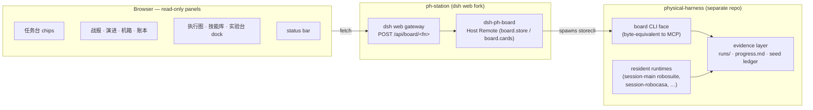

# physical-harness 操作台 (ph-station)

[English](README.md) | 中文

`ph-station` 是 **[physical-harness](https://github.com/Z-Robotics-Lab/physical-harness)** 的操作台（实验室控制台）——一个在 [DeepSeek Harness](https://github.com/deepseek-ai/deepseek-harness)（`dsh`，MIT）之上换标扩展的 fork。harness 是一个插件内核，运行着一台机器人**证据机器**：受治理的仿真 rollout、配对门禁的技能晋级、链式审计的 episode 账本。本 fork 把上游 harness 作为接口层保留，并新增一组**只读面板**，将 harness 的 campaign 证据直接呈现在 agent 对话旁边——操作员在同一屏里提任务、看证据，永远不用开第二个终端。

**红线：UI 里零业务逻辑。** 面板显示的每个数字都经由 harness 的 `board` 证据层从线上取回；TypeScript 只做格式化与排版，不做任何计算。

## 架构



浏览器面板请求 `/api/board/<fn>`（如 `stores`、`store`、`cards`、`ledger`、`campaignProgress`、`sessions`）。网关把每个请求路由给 `dsh-ph-board` Host Remote，后者调用 harness 的 `board` CLI 面并原样返回其字节。harness 的常驻运行时负责写证据；控制台只读。当 board 桥接未挂载时（无 `PH_BOARD_*` 环境变量的裸 `dsh web`），面板报告数据面不可用——绝不伪造数字。

## 与上游的关系

- 与上游一致，采用 [MIT](LICENSE) 许可；完整保留上游署名与 [THIRD_PARTY_NOTICES.md](THIRD_PARTY_NOTICES.md)。
- 保留 `upstream` git remote（`deepseek-ai/deepseek-harness`），以便向前合并上游修复。
- fork 的全部新增内容都落在一个 host package、七个 client package 以及控制台品牌里：
  - `packages/host/dsh-ph-board` —— 只读的 `board` Host Remote，把面板桥接到证据层。
  - `packages/client/ui-ph-battle` —— 战报面板。
  - `packages/client/ui-ph-panels` —— 演进 / 机箱 / 账本 面板、任务台 chips 以及状态栏。
  - `packages/client/ui-ph-ops` —— 指挥员侧栏与 graph-first 任务驾驶舱。
  - `packages/client/ui-ph-livegraph` —— 执行图 实时执行图面板。
  - `packages/client/ui-ph-vault` —— 技能库 Skill Vault wiki 面板。
  - `packages/client/ui-ph-dash` —— 实验台 dockview 仪表盘，把其余面板停靠在同一屏。
  - `packages/client/ui-ph-icons` —— 共享的驾驶舱图标集，vendored 的 tabler-icons MIT 子集。
  - **品牌** —— `packages/client/ui-brand-official` 中的 `physical-harness` 字标与 `PH` 徽标。

## 安装与构建

Node 22（或 ≥24）+ pnpm，经 nvm 与 corepack 选择：

```sh
source ~/.nvm/nvm.sh && nvm use 22   # engines: ^22.19.0 || >=24.0.0
corepack enable                       # provides pnpm 11.7.0 (see packageManager)
pnpm install                          # install workspace dependencies
pnpm run build                        # tsc emits lib/types, tsdown bundles the runtime
pnpm run typecheck                    # the build tsconfig is stricter than typecheck
pnpm run dev:web                      # watch-mode Web UI for panel development
```

### 外部依赖

| 库 | 版本 | 用途 | 备注 |
|---|---|---|---|
| Node.js | `^22.19.0 \|\| >=24.0.0` | 运行时 | 经 nvm 选 node 22 |
| pnpm | `11.7.0` | workspace 包管理器 | 经 corepack（`packageManager`） |
| TypeScript | `^6.0.3` | typecheck + `lib/types` 产出 | 全量 strict |
| tsdown | `^0.22.2` | 运行时打包（`pnpm build`） | build tsconfig 比 typecheck 更严 |
| vitest | `^4.1.8` | 单元 / e2e / snapshot 测试 | — |
| @types/node | `^22.20.0` | Node 类型 | — |
| vendored Cordis | pinned（`vendor/`） | harness 所基于的插件内核 | rescoped `@deepseek-ai/*`，MIT（[manifest](vendor/README.md)） |
| native/landlock-run | vendored 预编译 | Linux x64/arm64 沙箱助手 | 仅 Linux 运行时特性，自带 LICENSE |

完整第三方披露见 [THIRD_PARTY_NOTICES.md](THIRD_PARTY_NOTICES.md)。

## 两者协同运行

`ph-station` 是操作员的**脸**；**physical-harness** 是拥有机器人、运行时与证据的后端。先装 harness（其 README 覆盖 base install 与 per-sim venv），再让它拉起本控制台：

1. 安装并构建本控制台（见上）。
2. 安装 physical-harness —— base install 为 `pip install -e ".[dev]"`（只需 numpy + zstandard）；仿真卡（robosuite、robocasa）是**独立 venv**，见 physical-harness README 及其 `requirements.md`。
3. 从 harness 的 cockpit 脚本一键起全部：它会构建本 fork、注入 `PH_BOARD_*` 路径，并在 `http://127.0.0.1:3080` 提供 Web UI：

```sh
/path/to/physical-harness/scripts/cockpit
```

控制台**不单独启动**——cockpit 是唯一入口。两者之间的线是 `POST /api/board/<fn>`：网关把每个面板请求经 `PH_BOARD_*` 路径转给 `board` CLI 面，因此面板渲染的正是 harness 证据层持有的内容。

## 面板

所有面板都是对话旁的只读操作面；每个数字都来自 `board` Remote（`board.store` / `board.cards`），由它读取 harness 证据层。

- **任务台** —— 输入框上方的预设 chips，用于预填一段可编辑的任务提示词（永不自动发送）。
- **战报** —— 单次 campaign 的战报：paired gate、McNemar fixed/broken、held-out 徽标、每代 Δpp。
- **演进** —— RSI 监视器：每代 Δpp 条形图，以及进度 feed 与进行中的 campaign 卡片。
- **机箱** —— 从 plugin manifest 读取的机箱卡片网格。
- **账本** —— seed-block 账本表格。
- **执行图 / 技能库 / 实验台** —— 实时执行图、Skill Vault wiki 与 dockview 仪表盘。
- **状态栏** —— MODE、boot 事实、心跳、board 可达性，以及取景窗（render）chip。

## 开发

仓库约定见 [AGENTS.md](AGENTS.md)；架构见 [docs/architecture.zh.md](docs/architecture.zh.md)。更深的材料留在 [docs/](docs/) 里——链接过去，不要内联。

## 许可证

[MIT](LICENSE)。第三方依赖及其许可证见 [THIRD_PARTY_NOTICES.md](THIRD_PARTY_NOTICES.md)。
